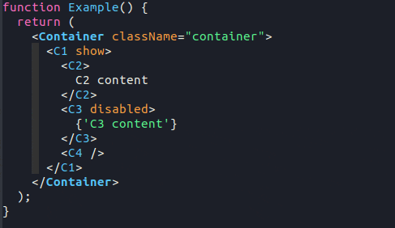
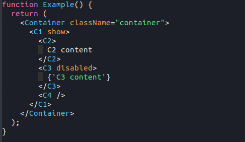
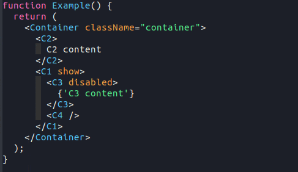
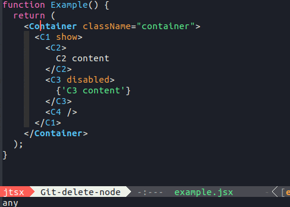
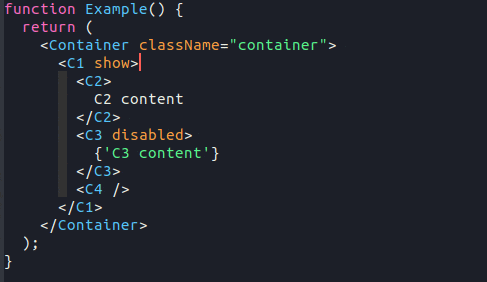

<!-- markdownlint-disable MD001 MD013 -->

# jtsx

## Extends Emacs JSX/TSX built-in support

`jtsx` is an Emacs package for editing `JSX` or `TSX` files. It provides `jtsx-jsx-mode` and `jtsx-tsx-mode` major modes implemented respectively on top of `js-ts-mode` and `tsx-ts-mode`, benefiting thus from the new built-in [Tree-sitter](https://tree-sitter.github.io/tree-sitter/) feature.

Summary of features and fixes:

* Fix commenting and indenting issues with `JSX` code in Emacs built-in `js-ts-mode` and `tsx-ts-mode` modes
* Refactoring: moving, wrapping, renaming `JSX` elements
* Jumping between `JSX` opening and closing tags
* Electric `JSX` closing tag
* Code folding

Note that `jtsx-jsx-mode` and `jtsx-tsx-mode` work as well respectively for standart `JS` and `TS` files.

## Requirements

Emacs 29.1 or higher, built with `tree-sitter` support (`./configure --with-tree-sitter`) is required. To check if your Emacs embeds `tree-sitter`, typing `M-x treesit` should give you at least `treesit-install-language-grammar` result.

⚠️ `jtsx` does not work with the deprecated [tree-sitter](https://github.com/emacs-tree-sitter/elisp-tree-sitter) package.

⚠️ Even if Emacs is built with `tree-sitter` support, `tree-sitter` languages are not installed by default. `Git` and a `C/C++` compiler are necessary to install them.

## Getting started

### Package installation

The straightforward way to install `jtsx` is through the [Melpa](https://melpa.org) package manager. You can find more informations on how to install a `Melpa` package [here](https://melpa.org/#/getting-started).

### `tree-sitter` languages installation

Installing `tree-sitter` languages is required by `jtsx` (`javascript` for `jtsx-jsx-mode`, `tsx` for `jtsx-tsx-mode`). You can use `M-x jtsx-install-treesit-language` command which is a convenient wrapper around `treesit-install-language-grammar` for that purpose.

For more advanced usages, see `M-x treesit-install-language-grammar` command, or manually compile and set up language libraries.

### Full configuration example

Here an example of configuration using [use-package](https://github.com/jwiegley/use-package), to put in the `Emacs` `init.el`:

* attach `jtsx-jsx-mode` to `JSX` and `JS` files
* attach `jtsx-tsx-mode` to `TSX` and `TS` files
* bind `jtsx` functions to the same shortcuts for `jtsx-jsx-mode` and `jtsx-tsx-mode`
* set indention offsets for `JSX` and `TSX` modes (use base mode variables)
* customize `jtsx` behaviour through provided variables
* enable `hideshow` minor mode for code folding

``` elisp
(use-package jtsx
  :ensure t
  :mode (("\\.jsx?\\'" . jtsx-jsx-mode)
         ("\\.tsx?\\'" . jtsx-tsx-mode))
  :commands jtsx-install-treesit-language
  :hook ((jtsx-jsx-mode . hs-minor-mode)
         (jtsx-tsx-mode . hs-minor-mode))
  :custom
  (js-indent-level 2)
  (typescript-ts-mode-indent-offset 2)
  (jtsx-switch-indent-offset 0)
  (jtsx-indent-statement-block-regarding-standalone-parent nil)
  (jtsx-jsx-element-move-allow-step-out t)
  (jtsx-enable-jsx-electric-closing-element t)
  (jtsx-enable-all-syntax-highlighting-features t)
  :config
  (defun jtsx-bind-keys-to-mode-map (mode-map)
    "Bind keys to MODE-MAP."
    (define-key mode-map (kbd "C-c C-j") 'jtsx-jump-jsx-element-tag-dwim)
    (define-key mode-map (kbd "C-c j o") 'jtsx-jump-jsx-opening-tag)
    (define-key mode-map (kbd "C-c j c") 'jtsx-jump-jsx-closing-tag)
    (define-key mode-map (kbd "C-c j r") 'jtsx-rename-jsx-element)
    (define-key mode-map (kbd "C-c <down>") 'jtsx-move-jsx-element-tag-forward)
    (define-key mode-map (kbd "C-c <up>") 'jtsx-move-jsx-element-tag-backward)
    (define-key mode-map (kbd "C-c C-<down>") 'jtsx-move-jsx-element-forward)
    (define-key mode-map (kbd "C-c C-<up>") 'jtsx-move-jsx-element-backward)
    (define-key mode-map (kbd "C-c C-S-<down>") 'jtsx-move-jsx-element-step-in-forward)
    (define-key mode-map (kbd "C-c C-S-<up>") 'jtsx-move-jsx-element-step-in-backward)
    (define-key mode-map (kbd "C-c j w") 'jtsx-wrap-in-jsx-element))
    
  (defun jtsx-bind-keys-to-jtsx-jsx-mode-map ()
      (jtsx-bind-keys-to-mode-map jtsx-jsx-mode-map))

  (defun jtsx-bind-keys-to-jtsx-tsx-mode-map ()
      (jtsx-bind-keys-to-mode-map jtsx-tsx-mode-map))

  (add-hook 'jtsx-jsx-mode-hook 'jtsx-bind-keys-to-jtsx-jsx-mode-map)
  (add-hook 'jtsx-tsx-mode-hook 'jtsx-bind-keys-to-jtsx-tsx-mode-map))
```

## Features

### Jumping between opening and closing tags

`M-x jtsx-jump-jsx-element-tag-dwim` jumps to the opening or closing tag of the `JSX` enclosing element. The furthest tag is choosen.\
`M-x jtsx-jump-jsx-opening-tag` jumps to the opening tag of the `JSX` enclosing element.\
`M-x jtsx-jump-jsx-closing-tag` jumps to the closing tag of the `JSX` enclosing element.



### Renaming elements

`M-x jtsx-rename-jsx-element` renames both the opening and closing tags of a `JSX` element. Cursor must either be inside the opening or the closing tag.


### Moving JSX elements

`jtsx` implements some commands to move a `JSX` tag or root node through the `JSX` structure, re-indenting automatically the modified part of code. `JSX` root nodes can be an element (self-closing or not), an expression or a text line.

`M-x jtsx-move-jsx-element-tag-forward` moves a JSX element tag (opening or closing) forward.\
`M-x jtsx-move-jsx-element-tag-backward` moves a JSX element tag (opening or closing) backward.


`M-x jtsx-move-jsx-element-forward` moves a JSX element (or any JSX root node) forward.\
`M-x jtsx-move-jsx-element-backward` moves a JSX element (or any JSX root node) backward.



`M-x jtsx-move-jsx-element-step-in-forward` moves a JSX element (or any JSX root node) forward. Step into sibling elements if possible.\
`M-x jtsx-move-jsx-element-step-in-backward` moves a JSX element (or any JSX root node) backward. Step into sibling elements if possible.



Stepping out when moving can be desactivated by setting `jtsx-jsx-element-move-allow-step-out` to `nil`.

### Wrapping a JSX block in a new JSX element

`M-x jtsx-wrap-in-jsx-element` wraps JSX root nodes in a new JSX element. Nodes are selected by a region if there is an active one. Else the node at point is used.



### Electricity

When entering the `>` of an opening tag, the pending closing tag is automatically added right after the cursor if relevant (the function tries to guess if the closing addition is expected or not).


This functionality can be desactivated by setting `jtsx-enable-jsx-electric-closing-element` to `nil`.

### Code folding

`jtsx-jsx-mode` and `jtsx-tsx-mode` customize built-in `Hideshow` package in order to support code folding into JSX parts.

`Hideshow` can be enabled with `M-x hs-minor-mode` command.

Please refer to [Hideshow documentation](https://www.gnu.org/software/emacs/manual/html_node/emacs/Hideshow.html) for usage informations.



## API

### Interactive functions

| Function                                 | Description                                                                                                                     |
|------------------------------------------|---------------------------------------------------------------------------------------------------------------------------------|
| `jtsx-jsx-mode`                               | Enable `jtsx-jsx-mode`                                                                                                               |
| `jtsx-tsx-mode`                               | Enable `jtsx-tsx-mode`                                                                                                               |
| `jtsx-jump-jsx-element-tag-dwim`         | Jump either to the opening or to the closing tag of the JSX element.                                                            |
| `jtsx-jump-jsx-opening-tag`              | Jump to the opening tag of the JSX element.                                                                                     |
| `jtsx-jump-jsx-closing-tag`              | Jump to the closing tag of the JSX element.                                                                                     |
| `jtsx-rename-jsx-element`                | Rename a JSX element at point. Point can be in the opening or closing tag.                                                      |
| `jtsx-move-jsx-element-tag-forward`      | Move a JSX element tag (opening or closing) forward.                                                                            |
| `jtsx-move-jsx-element-tag-backward`     | Move a JSX element tag (opening or closing) backward.                                                                           |
| `jtsx-move-jsx-element-forward`          | Move a JSX element (or any JSX root node) forward.                                                                              |
| `jtsx-move-jsx-element-backward`         | Move a JSX element (or any JSX root node) backward.                                                                             |
| `jtsx-move-jsx-element-step-in-forward`  | Move a JSX element (or any JSX root node) forward. Step into sibling elements if possible.                                      |
| `jtsx-move-jsx-element-step-in-backward` | Move a JSX element (or any JSX root node) backward. Step into sibling elements if possible.                                     |
| `jtsx-wrap-in-jsx-element`               | Wrap JSX root nodes in a JSX element. Nodes are selected by a region if there is an active one. Else the node at point is used. |


### Customizable variables

| Variables                                                 | Default | Description                                                                                                                                                                                                                                             |
|-----------------------------------------------------------|---------|---------------------------------------------------------------------------------------------------------------------------------------------------------------------------------------------------------------------------------------------------------|
| `jtsx-switch-indent-offset`                               | `0`     | Offset for indenting the contents of a switch block. The value must not be negative.                                                                                                                                                                    |
| `jtsx-indent-statement-block-regarding-standalone-parent` | `nil`   | Use standalone parent as anchor to evaluate statement block indentation. If t and if the parent of a statement block is not on its own line, the statement block will be indented relative to the beginning of the whole parent continuated expression. |
| `jtsx-jsx-element-move-allow-step-out`                    | `t`     | Allow to step out when moving a jsx element.                                                                                                                                                                                                            |
| `jtsx-enable-jsx-electric-closing-element`                | `t`     | Enable electric JSX closing element feature.                                                                                                                                                                                                            |
| `jtsx-enable-all-syntax-highlighting-features`            | `t`     | Enable all available syntax highlighting features.                                                                                                                                                                                                      |

## FAQ

### Jumping or refactoring functions sometimes fail, what is going wrong ?

An invalid `JSX` syntax in the buffer can be the source of the problem. `Tree-sitter` tries to be resilient regarding syntax validity, but sometimes the parser cannot (or is not smart enough to) guess what the errored code means exactly.

### Why another major mode for editing `JSX` ?

Although popular [`web-mode`](https://github.com/fxbois/web-mode) and [`rjsx-mode`](https://github.com/felipeochoa/rjsx-mode) are very good packages for `JSX` edition, they have been written when Emacs built-in `JSX` support was very poor or absent. Currently, Emacs comes with a quite good `JSX` / `TSX` support and even gives the possibility to use `Tree-sitter` integration. `jtsx` takes advantage of these new features to provide a lightweight package targetting both `JSX` and `TSX` with some handy functionalities.
